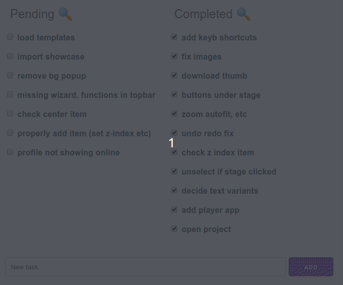

# DevTodo2 Web Extenstion

[DevTodo2](https://github.com/alecthomas/devtodo2) is an amazing command line task manager for Linux.

This is a web plugin for it so that you can view / edit / search your todo list using the browser too.

## Screenshot



Works in any resolution thanks to responsive css!

## Requirements

- PHP 7+

If you don't have PHP on your machine just run `sudo apt install php`

## Installation

Just clone this repo and add the directory to your path (update `$PATH` in `.bashrc`)

````
git clone git://github.com/san-kumar/devtodo2-web-extension.git ~/devtodo2-web-extension
echo 'PATH="$PATH:~/devtodo2-web-extension"' >> ~/.bashrc
source ~/.bashrc
todo2 -a "test"
todo2-web
````

Make sure you understand what the commands do before you start copy-pasting ;)

## Running

Just run `todo2-web` in any directory that has a `.todo2` file in it. It should open up your web browser and you should see your todo list!

The program basically reads and modifies the `.todo2` file using the PHP script.

## Uninstalling

Just delete the `~/devtodo2-web-extension` directory and undo any changes to `$PATH`. Also run `killall php` to stop the PHP server.

## About

It is just a 100 lines of PHP & Javascript. The front-end uses Vuejs and Milligram framework. Took me less than 2 hours to write it including this README file &#x263A;
 

Made it to scratch my own itch but in case someone finds it useful let me know!

## Credits

All credit goes to [Alec Thomas](https://github.com/alecthomas) for his wonderful software.